# DevOps-Technical-Environment-Setup
The project provides detailed instructions for installing essential software tools such as Git, Visual Studio Code (VScode), virtual box, etc, alongside necessary accounts creation like AWS and GitHub. Each section is carefully linked to official sources for downloads and account setups, ensuring both ease of access and security.

## Tools needed to be Installed
1. Visual studio code (VScode)
2. Git
3. Virtual box
4. Ubuntu on Virtual box (Windows)

## Visual studio code (VScode)
...Visual Studio Code (VS Code) is a powerful, lightweight, and versatile code editor developed by Microsoft, designed for a wide range of programming languages and development tasks. Available across Windows, macOS, and Linux, it offers features like IntelliSense for smart code completion, integrated Git support for seamless version control, and an in-built terminal for command-line operations. Its vast extension marketplace allows users to customize the editor with additional tools, debuggers, and themes, making it adaptable to various development workflows. VS Code is widely praised for its speed, flexibility, and robust features, making it a top choice among developers.

### Windows installation
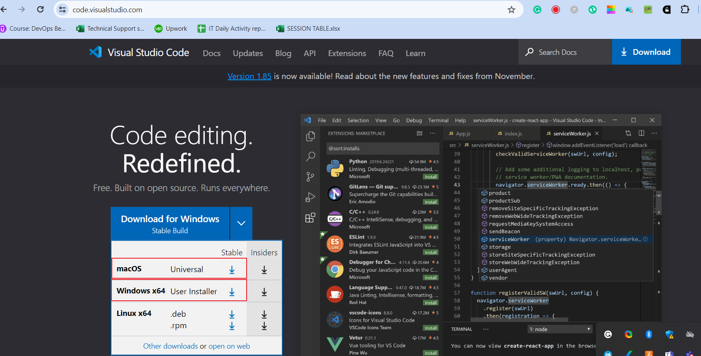

...On the web page, click "Download for Windows," if you are using windows system.
Locate the downloaded .exe file, double-click to run the installer.
Click "Next" through the installation wizard. Click next to all the remaining prompt
Lastly, click install to complete the installation. When installation is complete click FINISH to complete the installation.

 ### Lauching VScode:
  Open from Start Menu or use the desktop shortcut or better still, just type viscode on windows app search.
If your installation is successful, it will have the following look after launching: It might be slightly different, but does not matter.

### macOS Instalation
On the web page, click "macOS" if you are using Apple laptop https://code.visualstudio.com/

#### Run Installer
 Locate the downloaded .zip file, Double-click to extract and open the VS Code application.
 ..Drag the Visual Studio Code icon to the "Applications" folder.
Navigate to the "Applications" folder, double-click on Visual Studio Code to open it.
If your installation is successful, it will have the following look after launching: It might be slightly different, but does not matter.
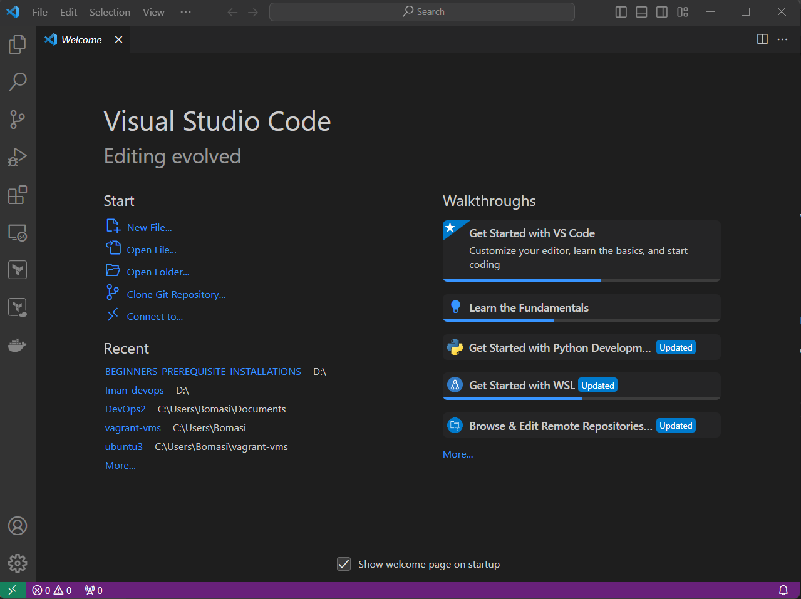
# Git

## Windows Installation:
Download Git: go to https://git-scm.com/download/win On the web page, Click "Download" to download the #### Git installer for Windows.
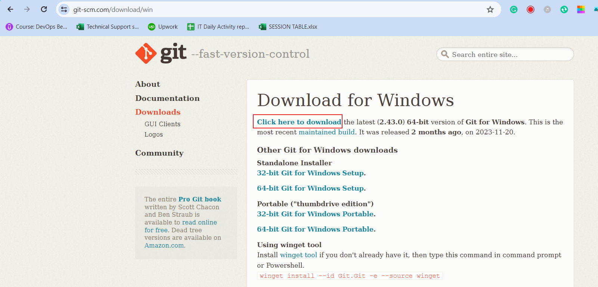
### Run installer
Locate the downloaded .exe file, Double-click to run the installer.  Click install to complete the installation. When installation is complete click FINISH to complete the installation.
If your installation is successful, it will have the following look after launching: It might be slightly different, but does not matter.

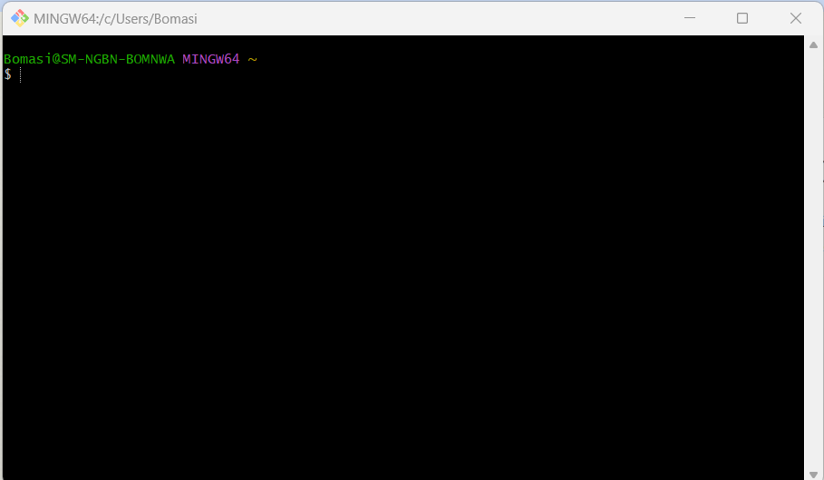

## Launch Git
Open Terminal and type git --version and press Enter to verify that Git has been installed.
If your installation is successful, it will have the following look after launching: It might be slightly different, but does not matter.
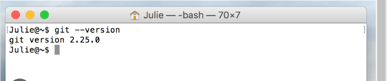

 ## Virtual Box
 ### 1. Windows Instalation
 Download Virtual box: https://www.virtualbox.org/ 

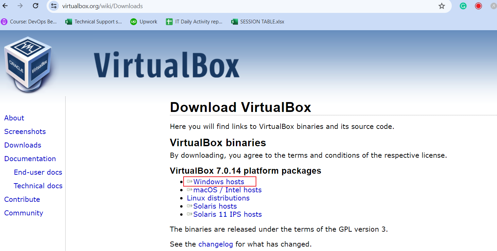
 On the web page, Click "Downloads" and select the Windows host version.
  Locate the downloaded .exe file, double-click to run the installer.  Click "Next" through the installation wizard. Click next to all the remaining prompt, leave every option to **default**.
Lastly, click install to complete the installation. When installation is complete click FINISH to complete the installation.

### Lauching Virtual box:
 Open from Start Menu or use the desktop shortcut or better still, just type viscode on windows app search.
 If your installation is successful, it will have the following look after launching: It might be slightly different, but does not matter.
 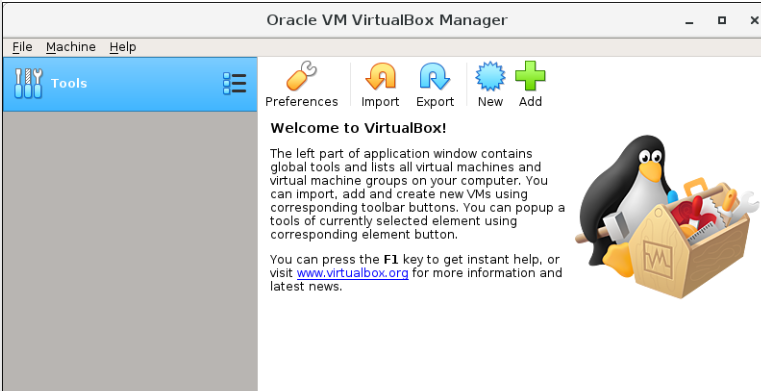

## Ubuntu (Linux Distro) on Virtual box (Windows Host)
Download Ubuntu Desktop ISO file: https://ubuntu.com/download/desktop

 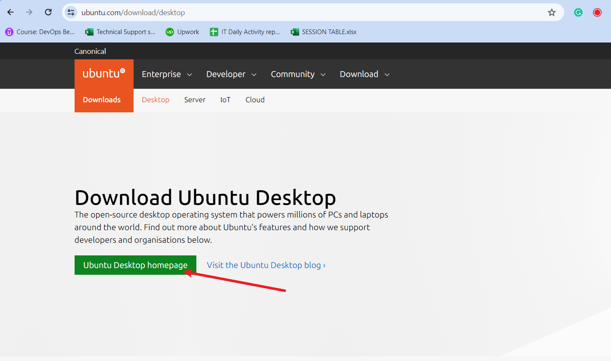
..Launch your already installed virtual box,  To create a new VM, click on NEW or Plus symbol at the top center of the virtual box window.

### Configure the virtual Machine
  choose Linux as the type, and Ubuntu as the version. Allocate at least 2GB of RAM for the virtual machine, Create a virtual hard disk, choosing either dynamic or fixed size, "dynamic" recommended.

#### Select an installation file
1. Choose the ubuntu .iso file that you downloaded from ubuntu website.
2. Start the Virtual Machine:
3. Launch the virtual machine and start the Ubuntu installation process.
4.  Follow the on-screen instructions to install Ubuntu, configuring language, keyboard, user account, etc.
5.  Remove the installation media when prompted, then power off the virtual machine, and ubuntu will boot to desktop as shown below, then you can enter the login credentials you created during the installation. ubuntu will boot to desktop as shown below, then you can enter the login credentials you created during the installation.
6. 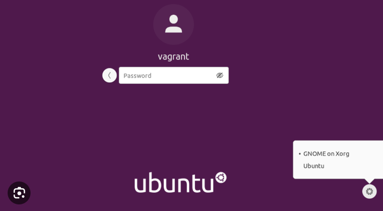

## Creating Github and AWS Account
 Open your web browser and go to https://github.com/
 
 
 On the GitHub homepage, you will find a "Sign up" button. Click on it.  Fill out the required information on the Sign up page. This typically includes your username, email address, and password. Choose a strong and secure password.
*After entering your information, GitHub will ask you to verify your email address. Check your email inbox for a verification message from GitHub and click on the verification link.*

GitHub may ask you to complete a CAPTCHA to ensure that you are not a robot. Follow the instructions to prove you're a human.

GitHub offers free plans for public repositories and paid plans for private repositories. Choose the plan that best suits your needs. For beginners, the free plan is usually sufficient.

_Once you've completed the above steps, you should be redirected to your new GitHub account. Congratulations! You now have a GitHub account._

$### Explore GitHub
Take some time to explore the GitHub platform. Familiarize yourself with the interface, and you can start by creating a new repository if you have a project in mind.
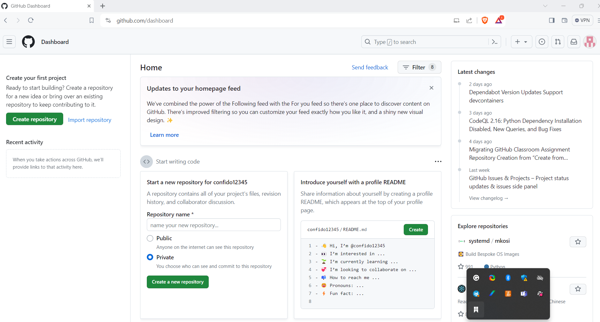

## Amazon Web Services (AWS) Account
Go to the AWS Free Tier page at https://aws.amazon.com/free/  to learn about the services available in the free tier and to start the signup process.

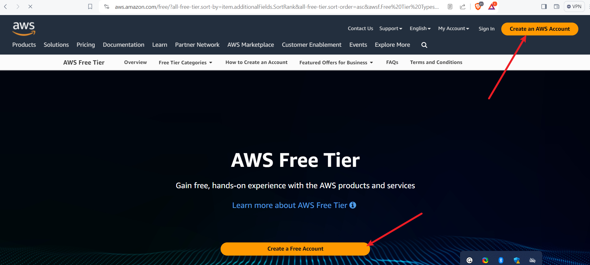

On the AWS Free Tier page, click on the "Create an AWS Account" button. Sign in or 
If you already have an Amazon account, you can sign in. If not, you'll need to create a new one.

Fill in the necessary account information, including your contact information and payment details. Note that you'll be required to provide valid credit card information, even though you won't be charged unless you exceed the free tier limits. You will be require to have a minimum of 1 usd in your card

_ Follow the steps to verify your identity. This may involve receiving a phone call or entering a verification code sent to your email or phone._

 AWS offers a free support plan, but you can choose to upgrade to a paid plan if you prefer. For the free tier, the basic support plan is usually sufficient.  As part of the account setup, you'll need to enter valid credit card information. AWS uses this for identity verification and to prevent abuse of the free tier resources.

 **Review the information you provided, read the terms and conditions, and confirm your agreement.**
After receiving confirmation, log in to the AWS Management Console using your new account credentials.  

### Explore the AWS Free Tier Services
AWS offers a variety of services within the free tier, including EC2 (Elastic Compute Cloud), S3 (Simple Storage Service), and more. Make sure to explore and understand the limitations of each service within the free tier.

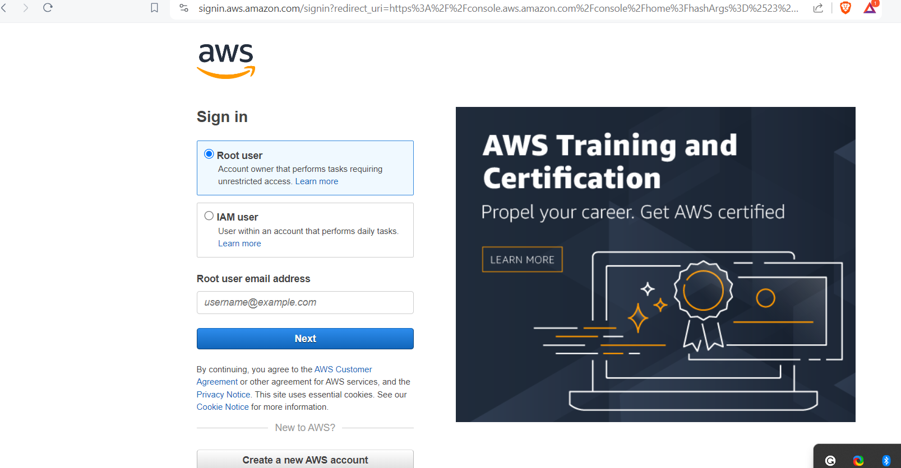

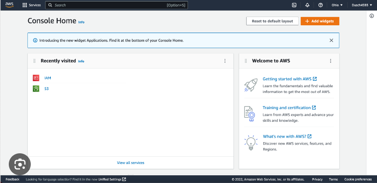